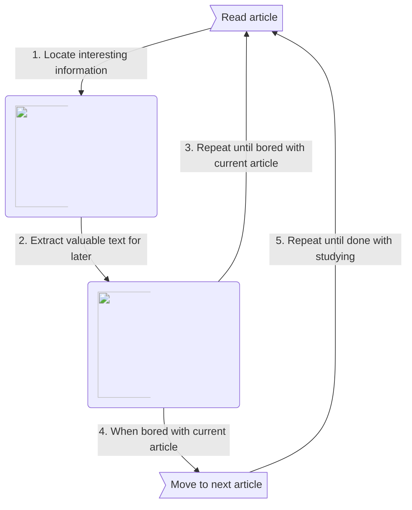
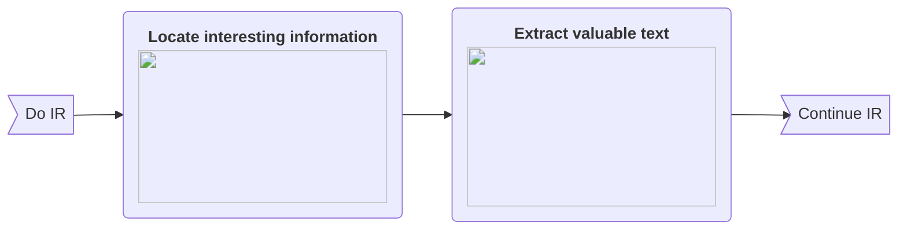
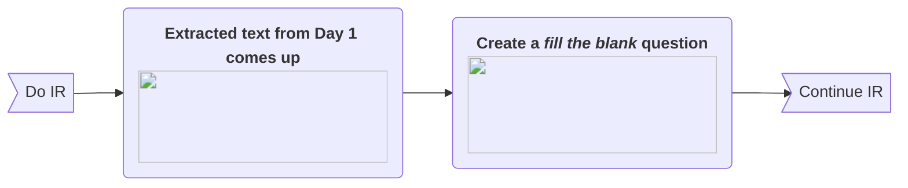
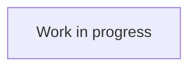

# Principles

**Incremental Reading (IR)** is a technique for organizing learning in a way that encourages *variety of studying material*. By contrast, traditional reading involves a linear process of reading a single topic for extended periods of time.

In the context of this wiki, **material** designates any sort of media through which learning can be achieved. Some example of material include: books, web articles, videos, podcasts, etc.

With [spaced repetition](/supermemo/spaced-repetition), IR is one of the two fundamental paradigms of SuperMemo.

## Comparison Matrix

This table **compares the principles** of incremental reading (parallel) and traditional reading (linear), based on their *average* implementation and usage. This is not representative of all the variations in which both of these methods can be executed.

<table>
  <tbody>
    <tr>
      <td width="200">
        

          <strong> </strong>
        

      </td>
      <td width="200">
        

          <strong>Incremental Reading</strong>
        

      </td>
      <td width="200">
        

          <strong>Traditional Reading</strong>
        

      </td>
    </tr>
    <tr>
      <td>
        

          <strong>Mindset</strong>
        

      </td>
      <td>
        
Read material until concentration or pleasure dwindles.

      </td>
      <td>
        
Read material for as long as possible.

      </td>
    </tr>
    <tr>
      <td>
        

          <strong>Variety of material</strong>
        

      </td>
      <td>
        
Many (up to hundreds).

      </td>
      <td>
        
Few (less than a dozen).

      </td>
    </tr>
    <tr>
      <td>
        

          <strong>Avg. Duration*</strong>
        

      </td>
      <td>
        
Seconds to minutes for each material.

      </td>
      <td>
        
Hours for each material.

      </td>
    </tr>
    <tr>
      <td>
        

          <strong>Min/Max Duration</strong>
        

      </td>
      <td>
        
Seconds to hours for each material.

      </td>
      <td>
        
Minutes to hours for each material.

      </td>
    </tr>
  </tbody>
</table>

> **^*^**: In IR, most material is gradually broken down into smaller chunks, hence the low average duration.
>
> **Nothing precludes an incremental reader from deliberately studying a single topic or material for hours** at a time. Typical motivations include:
> - studying for school,
> - acumen for a subject matter.
> 
> . <!-- The class is applied to the <ul> list otherwise -->
{.is-info}

## General flow of Incremental Reading (simplified)

In Incremental Reading, all the material yet to be processed is added into a [queue](/supermemo/queues). **Each element** in the queue is **examined in succession**.

How long to study each element before moving on to the next one is left at the discretion of the user's own heuristics. Typical triggers for making that decision include decreases in concentration or pleasure.

## Example: Evolution over a few days

This example illustrates the **evolution of a paragraph** taken from the [wiki article](https://en.wikipedia.org/wiki/Learning#Non-associative_learning) about *Learning*. The actual order of reviews and formulation of items might differ from person to person.

> The numbers assigned to each day are only meant as an illustration for the purpose of our example. Actual intervals between repetitions will typically be larger within SuperMemo.
>
> A more accurate term here would have been **stage**, but **day** was used instead for its intuititivity.
{.is-info}

### Day 1 of Incremental Reading

### Day 2 of Incremental Reading

### Day 3 of Incremental Reading

# History

It was created by [Piotr Wozniak](/en/supermemo/piotr-wozniak) in xxxx.

# Benefits

-  Simplicity in converting passive material into long-term active recall through quick cloze deletions
  
- Gradual convertion of knowledge with low up-front costs
  
- Peace of mind knowing you can import anything you wish to learn about and know it will come to you eventually
  
- It's fun!

# Incremental Reading in SuperMemo

After importing an article, it will eventually be shown to you again. You read the article and highlight and extract `(alt + x)` the bits you find important. 

Those extracts will then be shown to you later, and you are able to repeat the process, only extracting the most important material from the extract.

Incrementally you will painlessly be boiled down to information-dense sentences, of which you can select the key information you wish to remember and make a cloze deletion `(alt + z)`.

Your incremental reading will involve a pleasant mix of articles (topics), extracts, and question-and-answers to learn from.

## Dealing with overabundant material

SuperMemo allows you to set priorities for every element, postponing the lesser-important material for as long as it needs to be delayed for. This way you can always be sure you are learning the most important material.

## Customization

- You can edit the proportion of topics vs items that you see. This contributes greatly to the enjoyment. `(toolbar -> learn -> sorting -> sorting criteria)`

- Take care to quickly dismiss sources that are unpleasureable to learn from `(ctrl + d)`

## Video examples

- [Learning about nutrition *Learning about nutrition, by Dr Piotr Wozniak.*](https://www.youtube.com/watch?v=DoQoeK53bP8)
- [Learning about WWII *Learning history of World War 2, by Dr Piotr Wozniak.*](https://www.youtube.com/watch?v=XRuLV2_A3Ts)
- [Timelapse of varied material *2 Hours of IR in 10 minutes, by Naess.*](https://www.youtube.com/watch?v=zinKj9nSYbM)
{.links-list}

