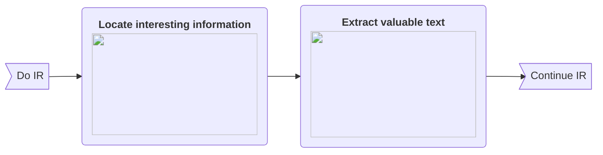
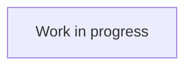

> 🙏 &nbsp;This wiki is new! If you are beginning with SuperMemo, **help me improve the quality of our articles**.
>
> Did you find this guide useful? Is there something you did not understand? Let me know and either:
>
> 1. Send me an [email](mailto:alexis@supermemo.wiki?subject=[SuperMemo.wiki]%20Feedback&body=Hello,%0D%0A%0D%0AAfter%20reading%20article%20[...]%20here%20is%20my%20feedback:%20[...]),
> 2. [Create an account](//supermemo.wiki/login) and leave a [comment](#discussion).
>
> Thank you!
{.is-warning}

 

# What is SuperMemo?

[**SuperMemo**](https://super-memo.com/supermemo18.html){target="_blank"} is a program that **makes learning fun and easy**.

SuperMemo is built on three novel learning techniques named [Spaced Repetition](/learning/spaced-repetition), [Incremental Reading](/learning/incremental-reading) and [Knowledge Destructuring](#knowledge-destructuring), all of which were pioneered by Dr. [Piotr Wozniak](/supermemo/piotr-wozniak)[^1], the inventor of SuperMemo. They enable anyone to form long-lasting memories, and to gain new knowledge more efficiently compared to traditional techniques.

While the success of SuperMemo is often attributed to its cutting-edge  algorithms and techniques, Dr. Piotr Wozniak and many <abbr title="Users who have been using SuperMemo for a duration ranging from a few years, up to several decades.">long-time users</abbr> of SuperMemo[^2] emphasize the central importance of [Pleasure of Learning](/learning/pleasure-of-learning) in all forms of learning activities.

## Why can SuperMemo change your life?

A few reasons why SuperMemo might **improve your life**:

### Tabs{.tabset}
#### I am Human

1. **You can learn to love learning (again):**
    - Learning is the best way to improve your life,
    - SuperMemo is built to make learning pleasurable,
    - As you progressively learn to love learning, your life will gradually improve!
2. **You can meet amazing people:**
    - [Our community](https://discord.gg/vUQhqCT) is oustandingly supportive and caring,
    - You will have discussions on topics that you cannot have elsewhere,
    - These discussions will spark new ideas and projects.

#### I am a Student (TODO)

🚧 Work in progress.

#### I am Salaried[^3] (TODO)

🚧 Work in progress.

#### I am a Policy Maker

1. **You can learn to better handle complexity**
    - Understanding politics and societies demands a lot of knowledge,
    - SuperMemo is built to handle large volume of information,
    - You will become more informed, and better equipped to make good decisions.
2. **You can spread the word**
    - Once you rediscover the pleasure of learning, you will be able to promote policies that encourage it,
    - People will become more educated, and more happy.
    
### User stories

Learn from the stories of SuperMemo users:

- [Humans of SuperMemo *Personal stories from users of SuperMemo.*](/supermemo/humans-of-supermemo)
- [Master how to Learn *A journey through learning, by Hnous.*](https://www.masterhowtolearn.com/2018-10-28-why-i-switched-to-supermemo/)
- [Antimoon *Me and SuperMemo, by Tomasz P. Szynalski.*](http://www.antimoon.com/how/tomandsm.htm)
{.links-list}

## Spaced Repetition

*Main article: [Spaced Repetition](/learning/spaced-repetition)*

**Spaced repetition (SR)** is a method for organizing your learning calendar in the most optimized way possible. It has two functions:
1. Remember what you learn forever,
2. In the minimum amount of time possible.

### How does it work?

In practice SR is performed by creating **flashcards** and assigning them a **forgetting index** within a computer software.

**Flashcard** is generic term for any association of knowledge. An example is the association between two words in different languages: "Hello" means "Bonjour" in French. The reciprocal association "Bonjour" -> "Hello" is another flashcard. They can be physical (paper cards) or virtual (like in SuperMemo).

The **forgetting index** is a number that represents the likelihood (e.g. 10%) you will forget a given piece of knowledge (e.g. "Hello" -> "Bonjour") before the next date on the calendar when SR has scheduled a **review** for it. For example, if on the 1st of January you learned that "Hello" means "Bonjour" in French, you might only be able to recall that with 90% certainty until the 20th of January. Past that date, the likelihood of recalling it will keep decreasing. This is because forgetting is exponential in nature:

Forgetting is avoided by **reviewing** your knowledge. Reviewing is the process of refreshing knowledge to ensure that it is persisted in memory. For example, on the 20th of January, you might quiz yourself:
> *What is the French translation for 'Hello'?*.

If you recalled correctly, then your memory of that knowledge will be persisted for an even longer time than you previously had, for example until March 31th with a 90% recall rate.

### Comparison Matrix

<table class="content-align-top">
  <tbody>
    <tr>
      <td width="180">
        

          <strong>
            <em> </em>
          </strong>
        

      </td>
      <td width="250">
        

          <strong>Spaced repetition</strong>
        

      </td>
      <td width="250">
        

          <strong>Traditional learning</strong>
        

      </td>
    </tr>
    <tr>
      <td>
        

          <em>Support</em>
        

      </td>
      <td>
        
Computer software<b>*</b>.

      </td>
      <td>
        
Any (usually pen &amp; paper).

      </td>
    </tr>
    <tr>
      <td>
        

          <em>Study plan</em>
        

      </td>
      <td>
        
Automatically scheduled by the algorithm.

      </td>
      <td>
        
Manually, either by:

        <ul>
          <li>Planning in advance (e.g., for an exam),</li>
          <li>Spontaneously (re-)reading a note or a book.</li>
        </ul>
      </td>
    </tr>
    <tr>
      <td>
        

          <em>Scalability</em>
        

      </td>
      <td>
        
High: the software does not forget what you want to remember.

      </td>
      <td>
        
Low: as you gain new knowledge, you will forget what you had previously learned.

      </td>
    </tr>
    <tr>
      <td>
        

          <em>Time spent learning</em>
        

      </td>
      <td>
        
Minimal: the algorithm computes the optimum interval between reviews.

      </td>
      <td>
        
Suboptimal: reviews will be random or arbitrary (e.g., for an exam).

      </td>
    </tr>
    <tr>
      <td>
        

          <em>Chance of remembering</em>
        

      </td>
      <td>
        
As high as desired, depending on the forgetting index.

      </td>
      <td>
        
Low, you will forget as soon as you stop using your knowledge.

      </td>
    </tr>
    <tr>
      <td>
        

          <em>Frequency of learning</em>
        

      </td>
      <td>
        
As frequent as desired<b>**</b>.

      </td>
      <td>
        
Arbitrary or random.

      </td>
    </tr>
  </tbody>
</table>

> **^\*^**: [Piotr Wozniak](/supermemo/piotr-wozniak) executed **spaced repetition on paper** for years before writing the first computer version with SuperMemo, read [his article](https://supermemo.guru/wiki/First_steps_of_SuperMemo#SuperMemo_on_paper).
> 
> **^\*\*^**: Missing out a few days is not the end of the world, but it will require more work later on!
{.is-info}

### Learning with Spaced Repetition

In SuperMemo, flashcards are called **items**. Items are associations of knowledge that you want to remember, such as the ones illustrated before.

| Cloze item | Q&A item |
|:==========:|:========:|
|  |  |
[***Two most common types of item***]

Typically, items are created either by:
- Generating them from imported content (e.g., a web article), a process called **clozing**,
- Copy-pasting content from another source (e.g., an e-book),
- Manually typing content with the keyboard.

**Clozing** is the process of creating a *gap question* by selecting the words to hide, and pressing <kbd>Alt</kbd> + <kbd>Z</kbd> on the keyboard. The cloze item presented above was created by clozing the words `simultaneous rhythms`.

Once an item is created in SuperMemo, it will be scheduled for review by the algorithm.

When **review time** comes, the answer will be hidden. After reading the prompt (e.g. the gap), you will try to recall the answer. Depending on your ability to successfully recall it, and after revealing the real answer, you will **grade** yourself.

From left to right, the first three grades and last two grades respectively represent different levels of ease for success and failure to recall.

The chosen grade will define how long elapses before the next review. In case of failure, the item will be rescheduled in the next few days.

## Knowledge Destructuring

**Knowledge Destructuring (KD)** is the process of dividing complex information into smaller chunks until it impossible to divide it any longer. Information created that way is called **atomic knowledge**.

In traditional learning, this is usually achieved by highlighting text and writing notes. With computers, this time consuming process is significantly cut down by directly selecting, editing and **extracting** text.

**Extracts** are chunks of knowledge (e.g. text, video, ...) clipped from a larger ensemble. For example, the first paragraph of a wikipedia article is usually dense with information and constitutes a good candidate for extraction.

<!-- Insert diagram (tree view?) with pictures -->

🚧 **Work in progress.**

## Incremental Reading

*Main article: [Incremental Reading](/learning/incremental-reading)*

**Incremental Reading (IR)** is a technique for organizing learning in a way that encourages *variety of studying material* and *iterative problem solving*. By contrast, traditional reading involves a linear process of reading a single topic for extended periods of time.

In the context of this wiki, **material** designates any sort of media through which learning can be achieved. Some example of material include: books, web articles, videos, podcasts, etc.

### Incrementalism

🚧 **Work in progress.**

### Comparison Matrix

This table **compares the principles** of incremental reading (parallel) and traditional reading (linear), based on their *average* implementation and usage. This is not representative of all the variations in which both of these methods can be executed.

<table>
  <tbody>
    <tr>
      <td width="200">
        

          <strong> </strong>
        

      </td>
      <td width="200">
        

          <strong>Incremental Reading</strong>
        

      </td>
      <td width="200">
        

          <strong>Traditional Reading</strong>
        

      </td>
    </tr>
    <tr>
      <td>
        

          <strong>Mindset</strong>
        

      </td>
      <td>
        
Read material until concentration or pleasure dwindles.

      </td>
      <td>
        
Read material for as long as possible.

      </td>
    </tr>
    <tr>
      <td>
        

          <strong>Variety of material</strong>
        

      </td>
      <td>
        
Many (up to hundreds).

      </td>
      <td>
        
Few (less than a dozen).

      </td>
    </tr>
    <tr>
      <td>
        

          <strong>Avg. Duration*</strong>
        

      </td>
      <td>
        
Seconds to minutes for each material.

      </td>
      <td>
        
Hours for each material.

      </td>
    </tr>
    <tr>
      <td>
        

          <strong>Min/Max Duration</strong>
        

      </td>
      <td>
        
Seconds to hours for each material.

      </td>
      <td>
        
Minutes to hours for each material.

      </td>
    </tr>
    <tr>
      <td>
        

          <strong>Thinking process</strong>
        

      </td>
      <td>
        
Incremental: knowledge is gradually revisited multiple times.

      </td>
      <td>
        
Linear: knowledge is processed only once or twice.

      </td>
    </tr>
  </tbody>
</table>

<blockquote class="is-info line">
  
<strong>*</strong>: In IR, most material is gradually broken down into smaller chunks, hence the low average duration.

  
<strong>Nothing precludes an incremental reader from deliberately studying a single topic or material for hours</strong> at a time. Typical motivations include:

  <ul>
    <li>Studying for school,</li>
    <li>Acumen for a subject matter.</li>
  </ul>
</blockquote>

<!--
> **^*^**: In IR, most material is gradually broken down into smaller chunks, hence the low average duration.
>
> **Nothing precludes an incremental reader from deliberately studying a single topic or material for hours** at a time. Typical motivations include:
> - studying for school,
> - acumen for a subject matter.
{.is-info}
-->

### General flow of Incremental Reading (simplified)

In Incremental Reading, all the material yet to be processed is added into a [queue](/supermemo/queues). **Each element** in the queue is **examined in succession**.

How long to study each element before moving on to the next one is left at the discretion of the user's own heuristics. Typical triggers for making that decision include decreases in concentration or pleasure.

### Example: Evolution over a few days

This example illustrates the **evolution of a paragraph** taken from the [wiki article](https://en.wikipedia.org/wiki/Learning#Non-associative_learning) about *Learning*. The actual order of reviews and formulation of items might differ from person to person.

> The numbers assigned to each day are only meant as an illustration for the purpose of our example. Actual intervals between repetitions will typically be larger within SuperMemo.
>
> A more accurate term here would have been **stage**, but **day** was used instead for its intuititivity.
{.is-info}

#### Day 1 of Incremental Reading

#### Day 2 of Incremental Reading

#### Day 3 of Incremental Reading

## Pleasure of learning

*Main article: [Pleasure of learning](/learning/pleasure-of-learning)*

🚧 Work in progress.

# Getting Started

- [First steps *Installation and Basic usage of SuperMemo.*](/supermemo/first-steps)
- [Backup Guide *Why risk losing years of work ? Set it up now, and forget about it !*](/supermemo/backup-guide)
- [Going further *Pointers for progressing to expert levels.*](/supermemo/going-further)
{.links-list}

## Video guides

- [Video guides *A series of video that will take you from Beginner to Advanced level.*](https://www.youtube.com/playlist?list=PL7RwmzKKAH8eKbDpOe5e-Omfp2Zqed6U1)
- [YouTube channel *Educative videos published by the SuperMemo.wiki community.*](https://youtube.com/c/SuperMemoWiki)
{.links-list}

  <iframe width="560" height="315" src="https://www.youtube-nocookie.com/embed/i33BTuwTgAs" frameborder="0" allow="accelerometer; autoplay; clipboard-write; encrypted-media; gyroscope; picture-in-picture" allowfullscreen></iframe>

[^1]: [History of spaced repetition](https://supermemo.guru/wiki/History_of_spaced_repetition)
[^2]: [Declaration of Educational Emancipation](https://supermemo.guru/wiki/Declaration_of_Educational_Emancipation:_Signatories)
[^3]: Word chosen on purpose. [Salary does not equate income YouTube video](https://www.youtube.com/watch?v=eyrEykrcQi0)

{.align-abstopright}