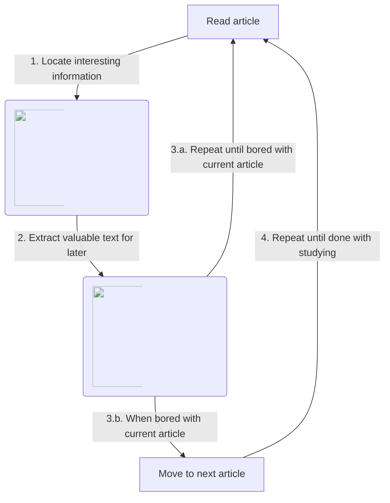

# What is SuperMemo ?

[**SuperMemo**](https://super-memo.com/supermemo18.html){target="_blank"} is a program that **makes learning easy and fun**.

SuperMemo is built on two novel learning techniques named [Spaced Repetition](/learning/spaced-repetition) and [Incremental Reading](/learning/incremental-reading), pioneered by Dr. [Piotr Wozniak](/supermemo/piotr-wozniak)[^1] the inventor of SuperMemo. They enable users to form long-lasting memories, and to gain new knowledge more efficiently compared with Traditional techniques.

While the success of SuperMemo is often attributed to its cutting-edge  algorithms and techniques, Dr. Piotr Wozniak and many <abbr title="Users who have been using SuperMemo for a duration ranging from a few years, up to several decades.">long-time users</abbr> of SuperMemo[^2] emphasize the central importance of [Pleasure of Learning](/learning/pleasure-of-learning) in all forms of learning activities.

## Spaced Repetition

> Main article: [Spaced Repetition](/learning/spaced-repetition)
{.is-info}

## Incremental Reading
> Main article: [Incremental Reading](/learning/incremental-reading)
{.is-info}

### Tabs{.tabset}
#### For personal growth

#### For School

Work in progress

## Why can SuperMemo change your life ?

Here are a few reasons why SuperMemo might **improve your life**:

### Tabs{.tabset}
#### I am Human

1. **You can learn to love learning (again):**
    - Learning is the best way to improve your life,
    - SuperMemo is built to make learning pleasurable,
    - As you progressively learn to love learning, your life will gradually improve!
2. **You can meet amazing people:**
    - [Our community](https://discord.gg/vUQhqCT) is oustandingly supportive and caring,
    - You will have discussions on topics that you cannot have elsewhere,
    - These discussions will spark new ideas and projects.

#### I am a Student (TODO)

TO DO !

#### I am Salaried[^3] (TODO)

TO DO !

#### I am a Policy Maker

1. **You can learn to better handle complexity**
    - Understanding politics and societies demands a lot of knowledge,
    - SuperMemo is built to handle large volume of information,
    - You will become more informed, and better equipped to make good decisions.
2. **You can spread the word**
    - Once you rediscover the pleasure of learning, you will be able to promote policies that encourage it,
    - People will become more educated, and more happy.

# Getting Started

- [First steps *Installation and Basic usage of SuperMemo.*](/supermemo/first-steps)
- [Backup Guide *Why risk losing years of work ? Set it up now, and forget about it !*](/supermemo/backup-guide)
- [Going further *Pointers for progressing to expert levels.*](/supermemo/going-further)
{.links-list}

## Video guides

- [Video guides *A series of video that will take you from Beginner to Advanced level.*](https://www.youtube.com/playlist?list=PL7RwmzKKAH8eKbDpOe5e-Omfp2Zqed6U1)
- [YouTube channel *Educative videos published by the SuperMemo.wiki community.*](https://www.youtube.com/channel/UCMdkN_8gHPn5vlYDe2ScrxQ)
{.links-list}

  <iframe width="560" height="315" src="https://www.youtube-nocookie.com/embed/i33BTuwTgAs" frameborder="0" allow="accelerometer; autoplay; clipboard-write; encrypted-media; gyroscope; picture-in-picture" allowfullscreen></iframe>

[^1]: https://supermemo.guru/wiki/History_of_spaced_repetition
[^2]: https://supermemo.guru/wiki/Declaration_of_Educational_Emancipation:_Signatories
[^3]: Word chosen purposedly, salary does not equate income https://www.youtube.com/watch?v=eyrEykrcQi0

{.align-abstopright}