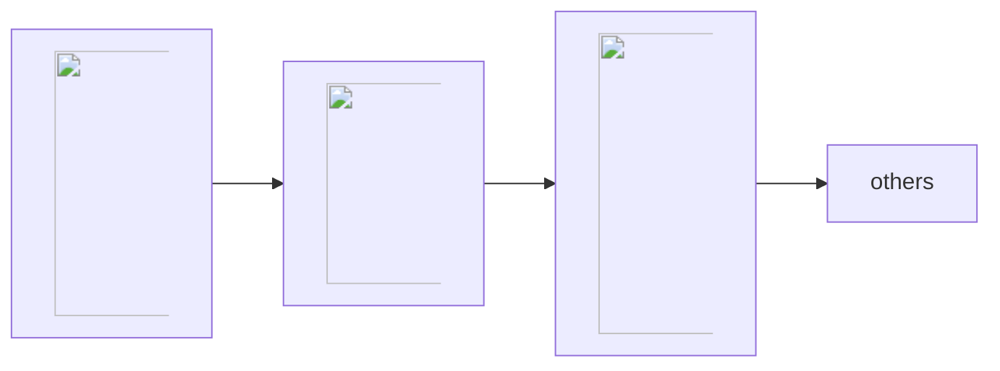

# What are Queues?

If you use [SuperMemo](/supermemo) long enough, your [collection](https://supermemo.guru/wiki/Collection) will grow to contain thousands of pieces of knowledge. They are called **elements**.

The multiplicity of material calls for a questions: in which order should I process each individual element? To address that question, SuperMemo implements **queues**: a set of elements ordered according to some criteria (e.g. priority, randomness, etc.)

