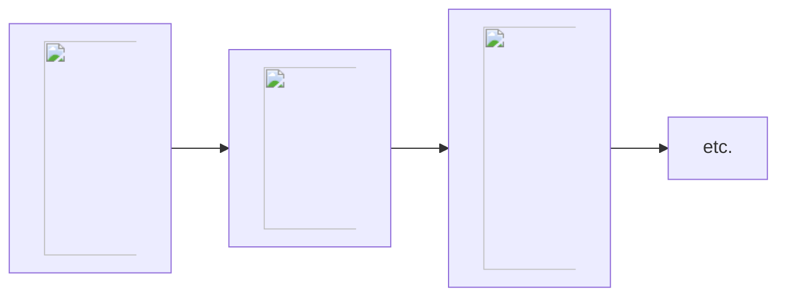

# What are Queues?

If you use [SuperMemo](/supermemo) long enough, your [collection](https://supermemo.guru/wiki/Collection) will grow to contain thousands of pieces of knowledge. They are called **elements**.

The multiplicity of material calls for a question: in which order should I process each individual element? To address that issue, SuperMemo implements **queues**: a set of elements ordered according to some criteria (e.g. priority, randomness, etc.)

For the rest of this article we will use the example below, three articles: Circadian rhythm, LTI and Anthropology.

## Priority queue

The priority queue contains all the elements ordered by priority. [Priorities](/supermemo/priority) are defined from 0% to 100%, with 0% being the most prioritized, and 100% the least prioritized.

In our example, let's assume the following priorities:
- Circadian rhythm: 5%

## Outstanding queue

## Pending queue