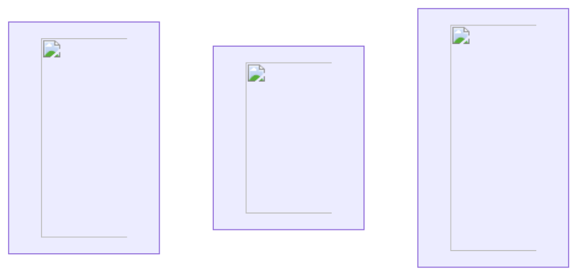
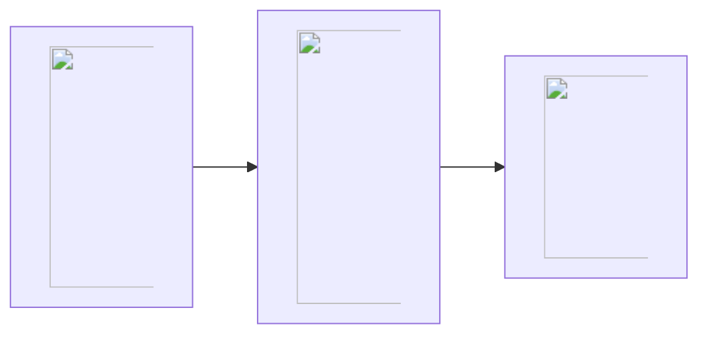

# What are Queues?

If you use [SuperMemo](/supermemo) long enough, your [collection](https://supermemo.guru/wiki/Collection) will grow to contain thousands of pieces of knowledge. They are called **elements**. An element can be:
- Item: an active element (i.e., you need to actively recall information). It is usually in the form of a Q&A, where you have to answer the question displayed, and then grade it according to how well you did.
- Topic: a passive element (i.e., you do not need to recall information). Topics are incrementally processed down to Items.
- Concept: a special element to which Items, Topics, Tasks, and indeed other Concepts link to. As the name suggests, a Concept represents an idea.
- Task: another special element which is used in [Tasklist manager](https://help.supermemo.org/wiki/Tasklist_manager).

The multiplicity of material calls for a question: in which order should I process each individual element? To address that issue, SuperMemo implements **queues**: a set of elements ordered according to some criteria (e.g. [priority](/supermemo/priority), randomness, etc.)

For the rest of this article we will use the example below, three articles: Circadian rhythm, LTI and Anthropology.

## Priority queue

The **priority queue** contains all the elements ordered by priority. [Priorities](/supermemo/priority) are defined from 0% to 100%, with 0% being the most prioritized, and 100% the least prioritized. In our example, let's assume the following priorities:
| Priorities                               |||
| Circadian rhythm |   LTI    | Anthropology |
|:================:|:========:|:============:|
| **5%**           | **75%** | **30%**      |

The resulting priority queue would be the following:

## Outstanding queue

🚧 Work in progress.

## Pending queue

🚧 Work in progress.